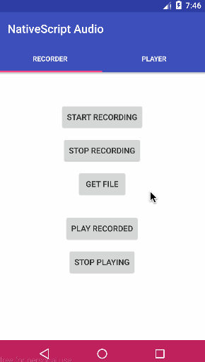

[](https://www.npmjs.com/package/nativescript-audio)
[](https://www.npmjs.com/package/nativescript-audio)

# NativeScript-Audio
NativeScript plugin to play and record audio files for Android and iOS.

Uses the following native classes:

#### Android

* [Player](http://developer.android.com/reference/android/media/MediaPlayer.html)
* [Recorder](http://developer.android.com/reference/android/media/MediaRecorder.html)

#### iOS

* [Player](https://developer.apple.com/library/ios/documentation/AVFoundation/Reference/AVAudioPlayerClassReference/)
* [Recorder](https://developer.apple.com/library/ios/documentation/AVFoundation/Reference/AVAudioRecorder_ClassReference/)

Note: You will need to grant permissions on iOS to allow the device to access the microphone if you are using the recording function. If you don't, your app may crash on device and/or your app might be rejected during Apple's review routine. To do this, add this key to your `app/App_Resources/iOS/Info.plist` file:

```
<key>NSMicrophoneUsageDescription</key>
	<string>Recording Practice Sessions</string>
```

## Installation
`tns plugin add nativescript-audio`

## Sample Screen



## Sample Usage

Just a simple example of how you could reuse player instances for a given file:

```
import { TNSPlayer } from 'nativescript-audio';

export class YourClass {
	private _player: TNSPlayer;
	
	constructor() {
		this._player = new TNSPlayer();
		this._player.initWithFile({
			audioFile: '~/audio/song.mp3', // ~ = app directory
			loop: false,
			completeCallback: this._trackComplete.bind(this),
			errorCallback: this._trackError.bind(this)
		}).then(() => {

			this._player.getAudioTrackDuration().then((duration) => {
				// iOS: duration is in seconds
				// Android: duration is in milliseconds
				console.log(`song duration:`, duration);
			});
		});
	}

	public togglePlay() {
		if (this._player.isAudioPlaying()) {
			this._player.pause();
		} else {
			this._player.play();
		}
	}

	private _trackComplete(info: any) {
		console.log('reference back to player:', info.player);

		// iOS only: flag indicating if completed succesfully
		console.log('whether song play completed successfully:', info.flag);
	}

	private _trackError(info: any) {
		console.log('reference back to player:', info.player);
		console.log('the error:', info.error);

		// Android only:
		console.log('extra info on the error:', info.extra);
	}
}

```

## API

#### TNSRecorder

Method |  Description
-------- | ---------
`TNSRecorder.CAN_RECORD()`: `boolean` | Determine if ready to record.
`start(options: AudioRecorderOptions)`: `Promise` | Start recording file.
`stop()`: `void` | Stop recording.
`dispose()`: `void` | Free up system resources when done with recorder.

#### TNSPlayer

Method |  Description
-------- | ---------
`initFromFile( { audioFile: string, loop: boolean, completeCallback?: Function, errorCallback?: Function, infoCallback?: Function; } )`: `Promise` | Initialize player instance with a file without auto-playing.
`playFromFile( { audioFile: string, loop: boolean, completeCallback?: Function, errorCallback?: Function, infoCallback?: Function; } )`: `Promise` | Auto-play from a file.
`initFromUrl( { audioFile: string, loop: boolean, completeCallback?: Function, errorCallback?: Function, infoCallback?: Function; } )`: `Promise` | Initialize player instance from a url without auto-playing.
`playFromUrl( { audioFile: string, loop: boolean, completeCallback?: Function, errorCallback?: Function, infoCallback?: Function; } )`: `Promise` | Auto-play from a url.
`pause()`: `Promise<boolean>` | Pause playback.
`resume()`: `void` | Resume playback.
`seekTo(time:number)`: `Promise<boolean>` | Seek to position.
`dispose()`: `Promise<boolean>` | Free up resources when done playing audio.
`isAudioPlaying()`: `boolean` | Determine if player is playing.
`getAudioTrackDuration()`: `Promise<string>` | duration of media file assigned to mediaPlayer
`volume`: `void` | Get/Set the player volume. Value range from 0 to 1.

You can access the underlying native class instance via `ios` and `android` getters on the respective platforms which will return you:

* `AVAudioPlayer` on iOS
* `MediaPlayer` on Android

Platform specific:

**iOS**:

`playAtTime(time: number)`: Play at a specific time.

## Why the TNS prefixed name?

`TNS` stands for **T**elerik **N**ative**S**cript

iOS uses classes prefixed with `NS` (stemming from the [NeXTSTEP](https://en.wikipedia.org/wiki/NeXTSTEP) days of old):
https://developer.apple.com/library/mac/documentation/Cocoa/Reference/Foundation/Classes/NSString_Class/

To avoid confusion with iOS native classes, `TNS` is used instead.

# License

[MIT](/LICENSE)
